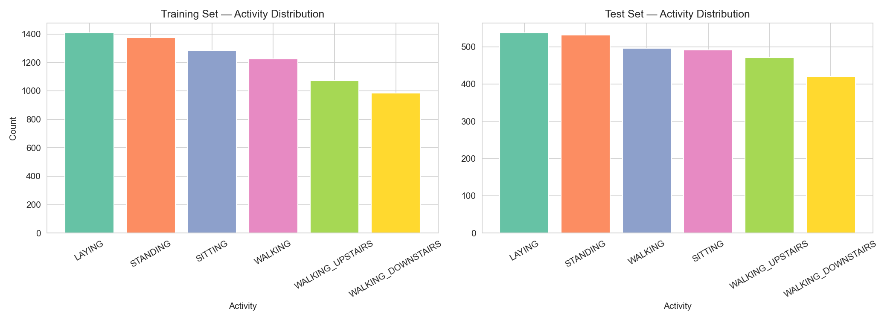
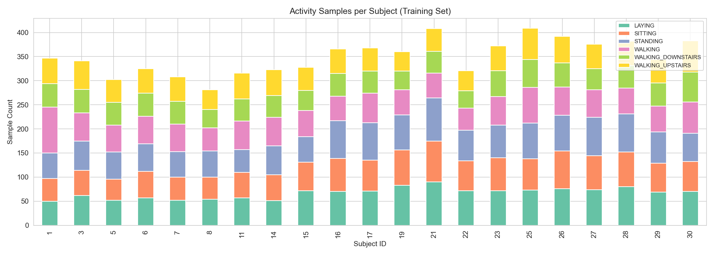
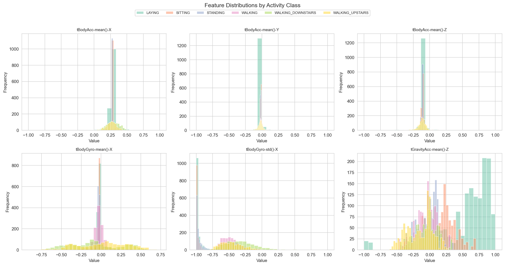
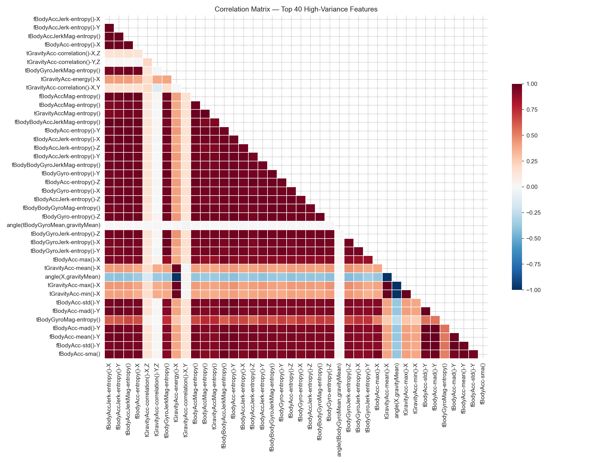
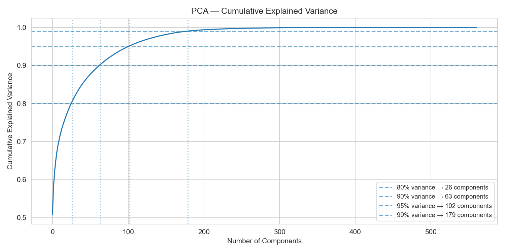
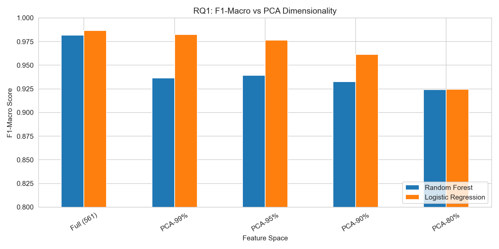
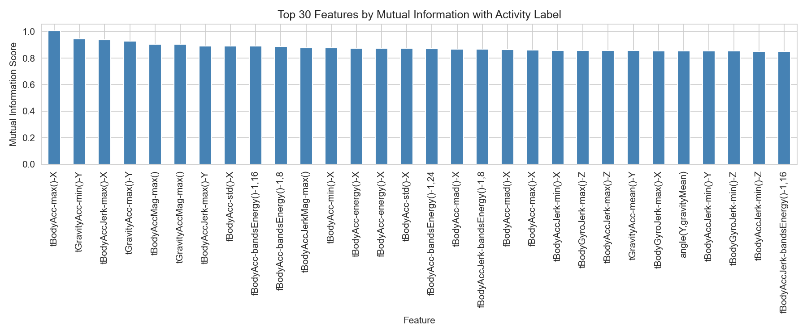
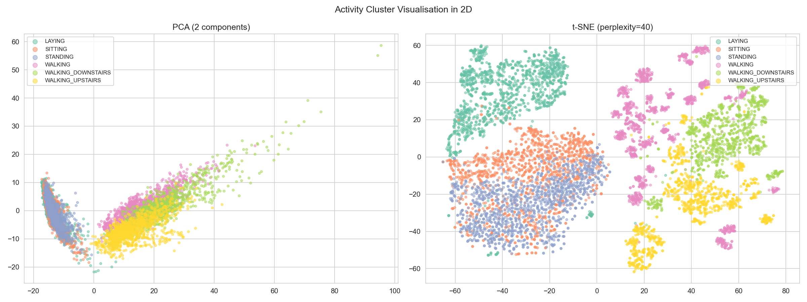

# Human Activity Recognition System using Machine Learning

<p align="center">
  <b>Sensor-Based Human Activity Classification using Classical Machine Learning Techniques</b>
</p>

<p align="center">
  Python • Scikit-learn • PCA • Random Forest • Extra Trees • Ridge Classifier
</p>

---

# Overview

This project presents a Human Activity Recognition (HAR) system developed using machine learning techniques on smartphone sensor data.

The study focuses on classifying human activities using accelerometer and gyroscope measurements collected from wearable devices. Multiple machine learning models and dimensionality reduction techniques were evaluated to investigate classification performance, computational efficiency, and feature-space optimization.

The project includes:
- Exploratory Data Analysis (EDA)
- PCA-based dimensionality reduction
- Feature importance analysis
- Activity cluster visualization
- Comparative machine learning experiments

---

# Research Questions

## RQ1 — PCA Dimensionality Reduction

Can reduced-dimensional feature spaces maintain classification performance compared to the full 561-feature dataset?

The project evaluates:
- PCA-99%
- PCA-95%
- PCA-90%
- PCA-80%

against the original feature space.

---

## RQ2 — Feature Importance

Which sensor-derived features contribute most strongly to activity classification?

Mutual Information analysis was used to rank features according to predictive importance.

---

## RQ3 — Activity Cluster Separability

How well do activity classes separate in lower-dimensional space?

PCA and t-SNE visualizations were used to investigate cluster structure and activity overlap.

---

# Dataset

The project uses the **UCI Human Activity Recognition Dataset**, which contains smartphone sensor signals collected from participants performing daily activities.

## Activities Classified

- Walking
- Walking Upstairs
- Walking Downstairs
- Sitting
- Standing
- Laying

---

# Technologies Used

| Technology | Purpose |
|---|---|
| Python | Core Programming |
| NumPy | Numerical Computation |
| Pandas | Data Processing |
| Scikit-learn | Machine Learning |
| Matplotlib | Visualization |
| Seaborn | Statistical Visualization |
| Jupyter Notebook | Experimentation |

---

# Machine Learning Pipeline

The workflow follows the pipeline below:

1. Data Loading
2. Exploratory Data Analysis
3. Feature Scaling
4. Dimensionality Reduction (PCA)
5. Feature Importance Analysis
6. Model Training
7. Performance Evaluation
8. Visualization & Interpretation

---

# Exploratory Data Analysis

## Activity Distribution

The dataset maintains relatively balanced activity distributions across training and testing sets.



---

## Activity Samples per Subject

Subject-wise activity distributions were analysed to investigate participant-level variation.



---

## Feature Distributions

Sensor feature distributions reveal clear differences between static and dynamic activities.



---

# Correlation Analysis

A correlation heatmap was generated to investigate relationships among high-variance sensor features.

Strong correlations were observed among several accelerometer and gyroscope measurements.



---

# Dimensionality Reduction using PCA

Principal Component Analysis (PCA) was applied to reduce feature dimensionality while preserving explained variance.

## PCA Explained Variance

The cumulative explained variance curve demonstrates how dimensionality reduction impacts retained information.



---

## PCA Performance Evaluation

Classification performance was evaluated across different PCA thresholds.



### Key Observation

- PCA-95% and PCA-99% retained near-full classification performance.
- PCA-80% introduced noticeable performance degradation.
- Logistic Regression showed stronger robustness under dimensionality reduction compared to Random Forest.

---

# Feature Importance Analysis

Mutual Information was used to identify the most informative sensor-derived features for activity recognition.



### Key Observation

Important features were primarily derived from:
- Body acceleration
- Gravity acceleration
- Gyroscope energy measurements
- Jerk signals

---

# Activity Cluster Visualization

## PCA vs t-SNE

2D visualizations were generated to analyse activity cluster separability.



### Key Observation

- t-SNE produced clearer class separation compared to PCA.
- Dynamic activities formed more distinct clusters.
- Static activities exhibited partial overlap in lower-dimensional space.

---

# Models Evaluated

The following machine learning models were implemented and compared:

| Model | Purpose |
|---|---|
| Random Forest | Ensemble-based classification |
| Extra Trees Classifier | Randomized tree ensemble |
| Ridge Classifier | Linear classification baseline |

---

# Evaluation Metrics

Models were evaluated using:

- Accuracy
- Precision
- Recall
- F1 Score
- Confusion Matrix

---

# Key Findings

- Ensemble-based models achieved strong classification performance.
- PCA significantly reduced dimensionality while preserving predictive performance.
- Mutual Information successfully identified highly discriminative sensor features.
- t-SNE visualizations revealed strong activity cluster separation.
- Random Forest and Extra Trees consistently demonstrated robust classification capability.

---

# Repository Structure

```bash
human-activity-recognition-system/
│
├── README.md
├── requirements.txt
│
├── notebooks/
│   └── human_activity_recognition.ipynb
│
├── reports/
│   └── HAR_Report.pdf
│
├── presentation/
│   └── HAR_Presentation.pdf
│
├── images/
│   ├── rq1_pca_performance.png
│   ├── feature_importance_mi.png
│   ├── pca_variance_curve.png
│   ├── eda_subject_distribution.png
│   ├── eda_tsne_pca_2d.png
│   ├── eda_correlation_heatmap.png
│   ├── eda_feature_distributions.png
│   └── eda_class_distribution.png
```

---

# How to Run

## 1. Clone Repository

```bash
git clone https://github.com/tharungurunathan/human-activity-recognition-system.git
```

---

## 2. Install Dependencies

```bash
pip install -r requirements.txt
```

---

## 3. Launch Notebook

```bash
jupyter notebook
```

Open:

```bash
notebooks/human_activity_recognition.ipynb
```

---

# Requirements

```txt
numpy
pandas
matplotlib
scikit-learn
seaborn
jupyter
scipy
```

---

# Future Improvements

Potential future enhancements include:

- Deep learning-based HAR models
- CNN/LSTM architectures
- Real-time activity recognition
- Mobile deployment
- Hyperparameter optimization
- Sensor fusion techniques

---

# Academic Context

This project was developed as part of academic coursework focused on machine learning and sensor-based activity recognition.

The work includes:
- feature engineering
- dimensionality reduction
- classifier evaluation
- exploratory analysis
- visualization-based interpretation

---

# Author

## Tharun Gurunathan

GitHub:
https://github.com/tharungurunathan

---

# License

This project is intended for academic and educational purposes.
